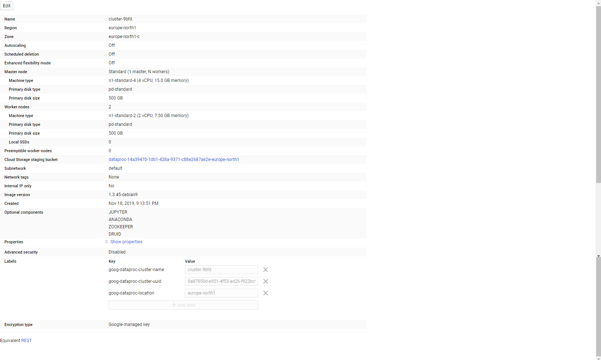

## Setup RabbitMQ broker

Open a GCP machine with the bitnami image for rabbitmq https://console.cloud.google.com/marketplace/details/bitnami-launchpad/rabbitmq?project=forward-subject-254912

After that run the shell script in `code/setup_rabbitmq.sh` This should setup all the packages. Now just run all the server scripts on nohup

## Setup Hadoop and Spark

Launch a dataproc Cluster on GCP with jupyter, anaconda, zookeeper enabled. The following image shows the configuration that I used. I had a master and two worker nodes setup.

Run the shell script `code/setup.sh` on the master node to setup the node with all the necessary configuration and packages.
