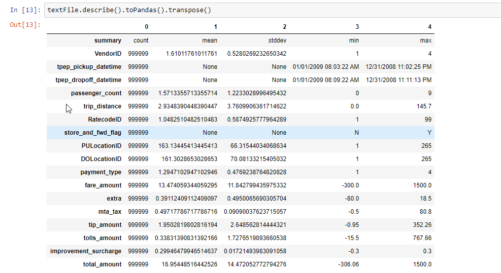

## Part 1 - Design for streaming analytics (weighted factor for grades = 4)

#### 1. Select a dataset suitable for streaming analytics for a customer as a running example (thus the basic unit of the data should be a discrete record/event data). Explain the dataset and at least two different analytics for the customer: (i) a streaming analytics which analyzes streaming data from the customer (customerstreamapp) and (ii) a batch analytics which analyzes historical results outputted by the streaming analytics. The explanation should be at a high level to allow us to understand the data and possible analytics so that, later on, you can implement and use them in answering other questions. (1 point)

I have selected the NYC Taxi data. The data used is collected and provided to the NYC Taxi and Limousine Commission (TLC).  It has the following fields of data VendorID, tpep_pickup_datetime, tpep_dropoff_datetime, Passenger_count, Trip_distance, PULocationID, DOLocationID, RateCodeID, Store_and_fwd_flag, Payment_type, Fare_amount, MTA_tax, Improvement_surcharge, Tip_amount, Tolls_amount, Total_amount. And the dataset is also large in terms of the number of entries. This helps to train my Machine Learning model. This is the reason I chose this dataset. More information about the dataset can be found [here](https://data.cityofnewyork.us/Transportation/2018-Yellow-Taxi-Trip-Data/t29m-gskq) Here is a glimpse of the data:

i) Streaming Analytics: I use Linear Regression to predict the fare amount and send it back to client. One outcome of this is to help the customers get an idea of the fare and to verify that they are not overcharged. To achieve high accuracy I initially checked for the correlation between the various attributes and selected the features which had high correlation with the fare price and I chose `'VendorID', 'passenger_count', 'trip_distance', 'RatecodeID'` as the features for the model.

ii) Batch Analytics: Batch Analytics are provided to determine the frequency of making a booking for all the `PULocationID`. An outcome of this would be to help the taxi drivers understand what location to be to get more trips to predict where its more probable to find his next trip.

#### 2. Customers will send data through message brokers/messaging systems which become data stream sources. Discuss and explain the following aspects for the streaming analytics: (i) should the analytics handle keyed or non-keyed data streams for the customer data, and (ii) which types of delivery guarantees should be suitable. (1 point)

(i) The analytics handles keyed data only, because if there is some feature missing, then the prediction will not work and hence the keyed nature of the message helps to verify this . Non-keyed data structures can also be used but the issue is when there are many features that are missing it can lead to errors.

(ii) Delivery guaranteed are handled by RabbitMQ. In the event of network failure (or a node failure), messages can be redelivered, and consumers must be prepared to handle deliveries they have seen in the past. If a message is delivered to a consumer and then requeued, either automatically by RabbitMQ or by the same or different consumer, RabbitMQ will set the redelivered flag on it when it is delivered again. This is a hint that a consumer may have seen this message before. This is not guaranteed as the original delivery might have not made it to any consumers due to a network or consumer application failure. If the redelivered flag is not set then it is guaranteed that the message has not been seen before. Therefore if a consumer finds it more expensive to deduplicate messages or process them in an idempotent manner, it can do this only for messages with the redelivered flag set. Also acknowledgements can be set up on RabbitMQ so that the customer knows that the message was delivered to the client. Also a data quality check is added on the server side by checking if all the keys are present in the message sent, if not the script raises an exception and does not ingest and does not run the analytics on the data point.

#### 3. Given streaming data from the customer (selected before). Explain the following issues: (i) which types of time should be associated with stream sources for the analytics and be considered in stream processing (if the data sources have no timestamps associated with events, then what would be your solution), and (ii) which types of windows should be developed for the analytics (if no window, then why). Explain these aspects and give examples. (1 point)

(i) The dataset consists of two timestamps namely the pickup time and dropoff time, this will help for the analytics to know the duration of the trip but it will also be useful to know the time of sending the data to ensure that the data received on the RabbitMQ queue by the server end is upto date. It is not an issue if the data is old and resent by the queue because of queue restart etc but it is important to know how old the data was so it can be handled in a proper way.

(ii) No windows need to be developed for the streaming analyics because the analysis is done for each tuple. The main model is the price predictor which processes the data as and when it is received and there is no merit to batch the data before tha analytics. Hence window is not implemented

#### 4. Explain which performance metrics would be important for the streaming analytics for your customer cases. (1 point)
There are three types of performance that is considered:

i) Data Upload performance: This is the time taken by the client to push the data row-wise to the message broker. This needs to be fast to be able to handle large sets of data. This can be one source of bottleneck if not designed properly. Hence this is an important metric and this metric has been analysed in the previous two assignments as well.

ii) Data Ingestion performance: This is the time taken to ingest the data after receiving the data from the RabbitMQ queue to adding it to the HDFS datastore. This is another source of bottleneck. If this takes too long the pipeline gets queued at this position

iii) Data Analytics performance: This is the time taken by spark to run the analytics (linear regression in the current implementation) on each data message. This is one of the most computationally expensive process in the pipeline and hence it is important to track this performance and to ensure Spark is set up properly to handle large amounts of data.

#### 5. Provide a design of your architecture for the streaming analytics service in which you clarify: customer data sources, mysimbdp message brokers, mysimbdp streaming computing service, customer streaming analytics app, mysimbdp-coredms, and other components, if needed. Explain your choices of technologies for implementing your design and reusability of existing assignment works. Note that the result from customerstreamapp will be sent back to the customer in near real-time. (1 point)

Here is the architecture overview of the entire system that I have built:

The leftmost element in the block diagram is a client system. The code for this is `rabbitmq_client.py` and handles sending the data to the message broker in a Keyed format. It reads a CSV file and converts it to a keyed data message and publishes the data to the message broker.

The next element is the message broker. I use RabbitMQ as the message broker. RabbitMQ is robust enough and is a very mature software that ensures reliability and also flexibility for the developers. The message broker is setup on GCP compute engine. The code for this message broker setup and its use is `rabbitmq_server.py`. Both this and the `rabbitmq_client.py` files are based on my work done in assignment2 and there is reuse of the code from there.

The next component is the Stream Analytics Cluster with Spark and Hadoop. The cluster is managed by Yarn and its hosted on Google Cloud Platform. The service on GCP is called DataProc. I have used Spark and Hadoop for the data analytics because of its excellent performance features and its ability to handle large volumes and velocity of data by the use of MapReduce. The cluster on GCP is set up with one master node and 2 slave nodes. Detailed configuration and setup instructions are provided in `reports/Deployment.md`. The DataProc cluster can also be set up to auto scale based on the CPU usage of it's nodes. But I have not sued that because of budget constraints. The code that needs to be run on the master node is in `customerstreamapp.py`. This listens on a RabbitMQ topic and then on receiving a message with the data, verifies the quality of the data and then converts it to the format required for `pySpark` using `VectorAssembler` and then predicts the output for each data point. The data is also sent to the `mysimbdp-coredms` and the predicted output is then published back to the `rabbitmq_client`.

The mysimbdp-coredms is Hadoop Distributed File System. I've chosen this because its part of the Apache ecosystem and goes well with Spark and Yarn setup. The logs after setting up the database can be found in `logs/hadoop.log`. All the incoming data is stored here as a csv file.  

The other component in the assignment is the `code/training.py` and a jupyter notebook `code/training_model.ipynb` which were used to build the LinearRegression model to predict the fare. For ease of use, I setup Anaconda and jupyet-notebook on the master node. I also tried out a couple of other Regression models and then compared between them and then decided to use Linear Regression because it was the best in time efficiency and had decent accuracy. The code `preprocess.py` helped to reduce the size of the dataset(The dataset used is a subset of the original NYC dataset, but it is still quite large) to ease the process of training etc.  

## Part 2 - Implementation of streaming analytics (weighted factor for grades = 4) Note: implementation part we expect to see real code, real numbers, real logs, real flows, etc. in your implementation. So try to answer and give examples with concrete results from your implementation.

#### 1. Explain the implemented structures of the input streaming data and the output result, and the data serialization/deserialization, for the streaming analytics application (customerstreamapp) for customers. (1 point)

The input streaming data is sent to the analytics platform (Spark). After performing the quality checks, the JSON data is deserialized and converted to a pandas data frame. Now the data is reordered to match the order of the attributes in the Hadoop file system. This data is appended to the existing dataset as a new tuple. The data contains more attributes than what the model is trained for. Now this row is transformed to filter all the non-important attributes and this is then fed to the linear regression model to predict the fare.  The predicted fare is again converted to a Python dictionary and then serialized to send it back to the client via RabbitMQ. This is done by the JSON module in python. The data is received  on the client end and is deserialized to store the analytics output, if required.

#### 2. Explain the key logic of functions for processing events/records in customerstreamapp in your implementation. (1 point)

I use Linear Regression to predict the fare amount and send it back to client. One outcome of this is to help the customers get an idea of the fare and to verify that they are not overcharged. To achieve high accuracy I initially checked for the correlation between the various attributes and selected the features which had high correlation with the fare price and I chose `'VendorID', 'passenger_count', 'trip_distance', 'RatecodeID'` as the features for the model. Here is the correlation between various attributes.

#### 3. Run customerstreamapp and show the operation of the customerstreamapp with your test environments. Explain the test environments. Discuss the analytics and its performance observations. (1 point)

The performance tests were done over 10,000 rows. The logs for the same are available under the `logs` folder. The mean of all the times taken for prediction is **193.45 ms**. The analytics model was trained on 1M samples using Spark. I have tried 3 different models and finally opted to use Linear Regression and this has a good balance between processing time and accuracy. Here are the brief outputs of the different models.

Here's a performance snapshot of the cluster I had configured, when I ran the tests. More details about the performance tests are also addressed in Part 2.5.

#### 4. Present your tests and explain them for the situation in which wrong data is sent from or is within data sources. Report how your implementation deals with that (e.g., exceptions, failures, and decreasing performance). You should test with different error rates. (1 point)

When there is missing data in the row then the model is not run. But when erroneous data is sent to the model, the model also fails to generalize well. For example, one test was done by sending negative distance value (which is impossible) for which the output was also a negative fare

    Time to run the prediction:0.171514034271
    +-------------------+-----------+------------------+
    |           features|fare_amount|        prediction|
    +-------------------+-----------+------------------+
    |[1.0,3.0,-19.1,1.0]|      -55.0|-58.57634032709260|
    +-------------------+-----------+------------------+

Hence the model is not robust enough and these kind of unrealistic data has to be filtered manually rather then expecting the model to handle outliers or errors.

#### 5. Explain parallelism settings in your implementation and test with different (higher) degrees of parallelism. Report the performance and issues you have observed in your testing environments. (1 point).

The platform is configured to use multiple threads by seting the number of execution cores to be used by spark as follows :

`sc.sparkContext._conf.set('spark.executor.cores', multiprocessing.cpu_count())`

This enables multithreading for spark and led to an increase in the prediction time. This sets the number of executor cores to 4 for my machine. This improves the parallelism and improves the performance. Detailed logs are available in the `logs` folder. A sample of the output log is provided here :

    Time to run the prediction:0.171514034271
    +------------------+-----------+------------------+
    |          features|fare_amount|        prediction|
    +------------------+-----------+------------------+
    |[1.0,3.0,20.1,1.0]|       59.0|59.227069043510866|
    +------------------+-----------+------------------+

    Time to run the prediction:0.19534611702
    +------------------+-----------+------------------+
    |          features|fare_amount|        prediction|
    +------------------+-----------+------------------+
    |[2.0,1.0,1.84,1.0]|       11.5|10.369131664896527|
    +------------------+-----------+------------------+

    Time to run the prediction:0.173733949661
    +------------------+-----------+-----------------+
    |          features|fare_amount|       prediction|
    +------------------+-----------+-----------------+
    |[2.0,1.0,4.72,1.0]|       20.5|18.05844281960807|
    +------------------+-----------+-----------------+

    Time to run the prediction:0.226330041885
    +------------------+-----------+----------------+
    |          features|fare_amount|      prediction|
    +------------------+-----------+----------------+
    |[2.0,6.0,1.25,1.0]|       12.5|8.77037627699542|
    +------------------+-----------+----------------+

The mean of all the times taken for prediction is **193.45 ms**

The mean of all the times taken for ingestion which includes the time taken for checking the input data for quality and the time taken to append to the file is **225.65ms**.

The third important performance is the time taken by the client to send the message to RabbitMQ broker. The mean over 10000 rows for this is **21.21ms**.

## Part 3 - Connection (weighted factor for grades = 2)

#### 1. If you would like the analytics results to be stored also into mysimbdp-coredms as the final sink, how would you modify the design and implement this (better to use a figure to explain your design). (1 point)

The analytics result can be appended to the row data and then be pushed to the hadoop file system. This can be easily done by adding the predicted_fare as a new feature and add it to each row of data as and when it is received. Another way to do this is to send the prediction back to the client via RabbitMQ and then let the client handle the ingestion to  the mysimbdp-coredms. This enables the client to access the coredms on his own and has the freedom to use it however he wants to. The red line in the figure below indicates the change that will have to be done.

#### 2. Given the output of streaming analytics stored in mysimbdp-coredms for a long time. Explain a batch analytics (see also Part 1, question 1) that could be used to analyze such historical data. How would you implement it? (1 point)

Batch Analytics based on the predicted fare can be used to calculate how profitable the taxi rides were for a period of time. For example, if we use a window of 1hr we can try to estimate the total earnings and try to predict if the earnings were higher than the general earning or lower than the average. We can identify patterns about when are the taxis most active, what are the most active zones in the city etc.
This can be implemented by first storing the predicted data in the HDFS for later use and then use a timed operation to run the aggregation operations for the last hour.

#### 3. Assume that the streaming analytics detects a critical condition (e.g., a very high rate of alerts) that should trigger the execution of a batch analytics to analyze historical data. How would you extend your architecture in Part 1 to support this (use a figure to explain your work)?. (1 point)

From the answer above, instead of a timed operation to run the batch analytics, we develop a script which listens on a topic all the time, and when an alert is raised a message is sent to this topic which triggers the batch analytics in the callback of the message. This means whenever the alert is raised, a message is sent to the RabbitMQ topic and the batch analytics is run. The red arrow in the modified architecture below shows the modification required. On the master we listen to the topic for the alerts and master does the aggregation for the past hour or any other time perios as required and runs the batch analytics.

#### 4. If you want to scale your streaming analytics service for many customers and data, which components would you focus and which techniques you want to use? (1 point)

The scaling of the system to support many customers is very easy to do in this platform because of its design. If we have individual configurations to support each client we can spawn multiple instances of the slave nodes to enable parallelism for data processing. Depending on the type of analytics provided this could prove to be one of the major bottleneck in terms of performance as the amount of data and customers increases. It can also be configured in such a way that the cluster auto scales based on  dynamic demand. For example if the amount of data is high during the day then the cluster handles this by spawning more slave nodes during the day and auto closes a few nodes when the demand for computation goes down. The other source of bottleneck could be from the data ingestion. This is again on the same cluster and hence this portion of the pipeline is also highly scalable. The third component in the system is the rabbitmq component. The bottleneck could become the RabbitMQ system because this is outside the cluster. In rabbitmq its important to  put every type of processing on different queues or broker, because separate workloads with different profiles of use can scale independently. Also, a load balancer in front allows us to publish once and then workers can subscribe to all. RabbitMQ is also a very stable component and it has been proven to be able to handle 30,000 persistent messages per second  in many systems.

#### 5. Is it possible to achieve end-to-end exactly once delivery in your current implementation? If yes, explain why. If not, what could be conditions and changes to make it happen? If it is impossible to have end-to-end exactly once delivery in your view, explain why. (1 point)

RabbitMQ offer durable messaging guarantees.
what these guarantees mean:
At-most-once delivery. This means that a message will never be delivered more than once but messages might be lost.
At-least-once delivery. This means that we'll never lose a message but a message might end up being delivered to a consumer more than once.
Exactly-once delivery. All messages will be delivered exactly one time.

Delivery is probably the wrong word for the above terms, instead Processing might be a better way of putting it. After all what we care about is whether a consumer can process a message and whether that is at-most-once, at-least-once or exactly-once. But using the word processing complicates things, exactly-once delivery makes less sense now as perhaps we need it to be delivered twice in order to be able to successfully process it once. If the consumer dies during processing, then we need that the message be delivered a second time for a new consumer. Secondly, talking about processing introduces the headache of partial failure. There are multiple steps in the processing of a message. It starts and ends with communication between the application and the messaging platform with the application logic in the middle. Partial failure scenarios of the application logic need to be dealt with by the application. If the operations performed are fully transactional and result in all or nothing then that avoids the partial failure of the application logic. But often multiple steps include different systems where transactional behaviour is not possible. When we include the communications between the messaging technology, the application, a cache and a database, can we really guarantee exactly-once processing? The answer is no. So exactly-once is limited to the scenario where the only output of the message processing is the messaging platform itself and that messaging platform provides strong transactions. With this limited scenario we can process a message, write a message and signal the message was processed, all in a transaction that results in all or nothing. This is what Kafka Streams offers.

End-to-End Signalling

Having argued about the advantages or the guarantees provided by RabbitMQ, however there is no end-to-end confirmation. In fact considering that a message in RabbitMQ could be routed to multiple queues, that doesn't even make sense. End-to-end is not possible.

Chain of Responsbility

Essentially, publishers cannot know that their messages get consumed. What they can know is that the messaging system has received their messages and has taken responsbility for storing them safely and delivering them to consumers. There is a chain of responsibility that starts with the publisher, then moves to the messaging system and finally the consumer. Each has to behave correctly when it is their turn to be responsible for a message and during the hand-overs of responsibility. This means that you as the developer must write your applications well, so that you don't lose or misuse messages while they are under your control.
